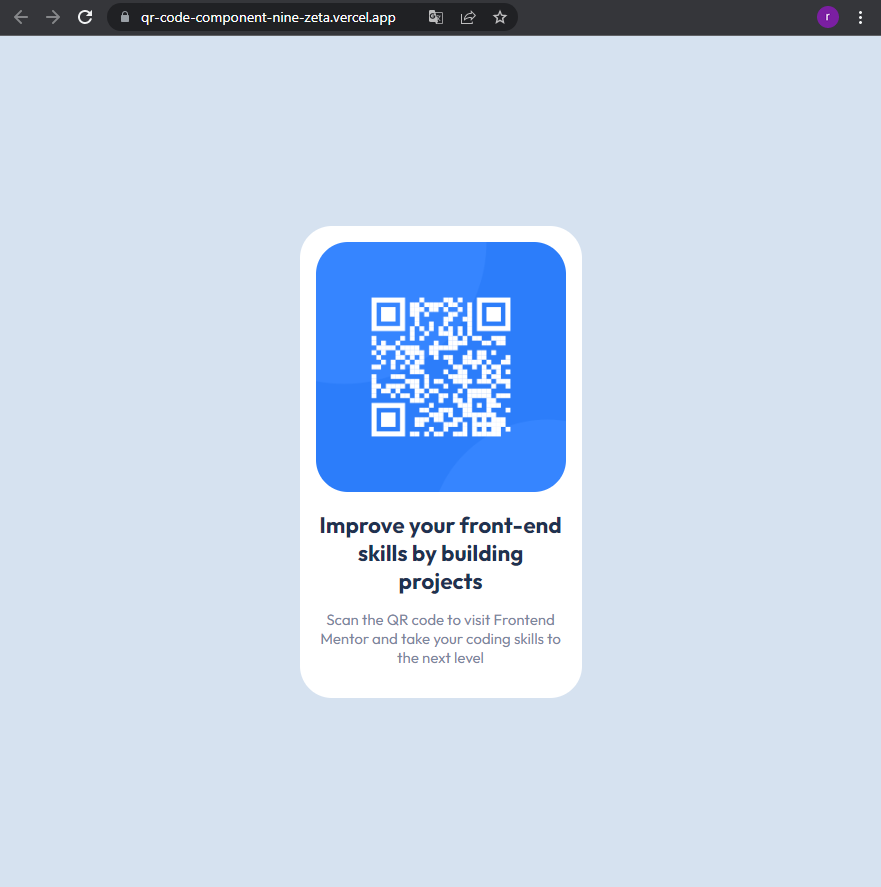

# Frontend Mentor - QR code component solution

This is a solution to the [QR code component challenge on Frontend Mentor](https://www.frontendmentor.io/challenges/qr-code-component-iux_sIO_H). Frontend Mentor challenges help you improve your coding skills by building realistic projects.

## Table of contents

- [Overview](#overview)
  - [Screenshot](#screenshot)
  - [Links](#links)
- [My process](#my-process)
  - [Built with](#built-with)
  - [What I learned](#what-i-learned)
  - [Useful resources](#useful-resources)
- [Author](#author)

**Note: Delete this note and update the table of contents based on what sections you keep.**

## Overview

### Screenshot



### Links

- Solution URL: [Github](https://github.com/remi-vieille/QR-code-component)
- Live Site URL: [vercel](https://qr-code-component-nine-zeta.vercel.app/)

## My process

### Built with

- HTML5

### What I learned

I had a scrollbar when i used 100vw and 100 vh

```css
.body {
  width: 100vw;
  height: 100vh;
}
```

but no scollbar when i use % instead.

```css
.body {
  width: 100%;
  height: 100%;
}
```

If you want more help with writing markdown, we'd recommend checking out [The Markdown Guide](https://www.markdownguide.org/) to learn more.

**Note: Delete this note and the content within this section and replace with your own learnings.**

### Useful resources

- [How To Load and Use Custom Fonts with CSS](https://www.digitalocean.com/community/tutorials/how-to-load-and-use-custom-fonts-with-css) - This helped me for importing css font from local relative folder.

## Author

- Website - [Vercel](https://qr-code-component-nine-zeta.vercel.app/)
- Frontend Mentor - [@remi-vieille](https://www.frontendmentor.io/profile/remi-vieille)
- Twitter - [@VieilleRemi](https://twitter.com/VieilleRemi)
